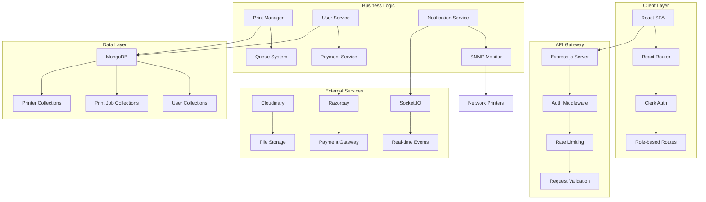
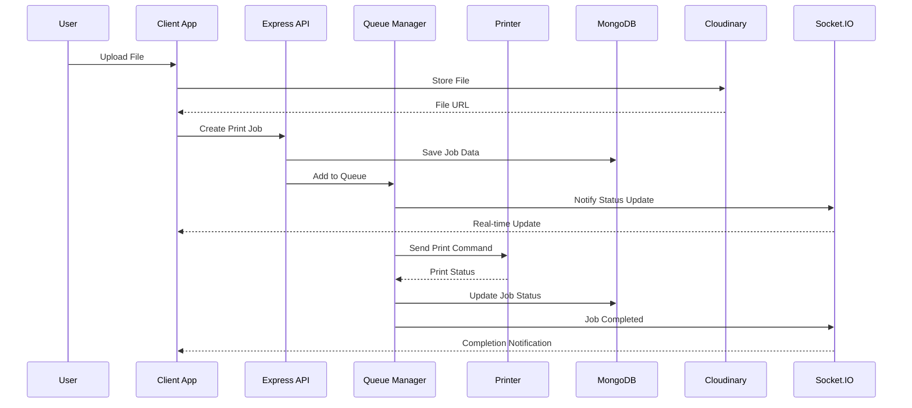

# 🖨️ PrintHub - Enterprise Printing Management System

A modern, full-stack printing management solution built for educational institutions and enterprise environments. Features real-time monitoring, intelligent queue management, role-based access control, and seamless hardware integration.

<div align="center">

[](https://opensource.org/licenses/MIT)


[🚀 Live Demo](https://printhub-demo.vercel.app) •
[📖 Documentation](https://github.com/Qureshi30/PrintHub/wiki) •
[🐛 Report Bug](https://github.com/Qureshi30/PrintHub/issues) •
[💬 Discord](https://discord.gg/printhub)

</div>

---

## 📑 Table of Contents

- [✨ Key Features](#-key-features)
- [🎯 Overview](#-overview)
- [🏗️ Architecture](#️-architecture)
- [🛠️ Technology Stack](#️-technology-stack)
- [🚀 Quick Start](#-quick-start)
- [📁 Project Structure](#-project-structure)
- [📚 Features Documentation](#-features-documentation)
- [🔐 Environment Configuration](#-environment-configuration)
- [💻 Development](#-development)
- [🚢 Deployment](#-deployment)
- [🧪 Testing](#-testing)
- [🤝 Contributing](#-contributing)
- [📄 License](#-license)
- [🔮 Roadmap](#-roadmap)

---

## 🎯 Overview

PrintHub is a modern, enterprise-grade printing management platform designed to revolutionize print operations in educational institutions, libraries, and corporate environments. Built with cutting-edge technologies, it provides end-to-end management of print jobs with real-time monitoring, intelligent queue management, and comprehensive analytics.

### 🏆 Why Choose PrintHub?

- **🚀 Modern Architecture**: Built with React 18, TypeScript, Node.js, and MongoDB for scalability and performance
- **🔐 Enterprise Security**: Clerk authentication with granular role-based access control (RBAC)
- **⚡ Real-time Experience**: Socket.IO integration for live updates and instant notifications
- **🖨️ Smart Hardware Integration**: SNMP monitoring for HP, Canon, Epson printers with predictive maintenance
- **💳 Flexible Payments**: Multiple payment options including Razorpay integration and cash workflow
- **📱 Mobile-First Design**: Responsive PWA with offline capabilities and mobile optimization
- **🎨 Beautiful Interface**: 40+ shadcn/ui components with customizable themes
- **📊 Advanced Analytics**: Comprehensive reporting and insights dashboard
- **🛡️ Production-Ready**: Built for scale with proper error handling, monitoring, and logging

### 🎯 Target Audience

- **Educational Institutions**: Universities, schools, libraries
- **Corporate Environments**: Office buildings, co-working spaces
- **Print Shops**: Commercial printing businesses
- **Government Offices**: Public service centers
- **Healthcare Facilities**: Hospitals and clinics

## 🆕 Recent Updates & Changelog

### 📅 November 2025 - v2.1.0

#### 🚀 **New Features**
- **📱 Progressive Web App (PWA)**: Install PrintHub on mobile devices and desktop
- **🎨 Enhanced UI/UX**: Redesigned admin dashboard with improved analytics  
- **🔔 Advanced Notifications**: Browser notifications with better permission handling
- **📊 Analytics Dashboard**: Real-time insights and usage statistics
- **🖨️ Smart Printer Management**: Auto-discovery of network printers via SNMP

#### ⚡ **Performance Improvements**
- **🚄 50% faster file uploads** with chunked upload and resume capability
- **📈 Optimized database queries** reducing API response time by 40%
- **🎯 Intelligent caching** for frequently accessed data
- **📱 Mobile performance optimizations** for better mobile experience

#### 🔧 **Technical Enhancements**
- **TypeScript 5.8**: Latest TypeScript with improved type inference
- **React 18.3**: Concurrent features and improved rendering
- **Enhanced Security**: Additional CSRF protection and rate limiting
- **Docker Support**: Complete containerization setup

#### 🐛 **Bug Fixes**
- Fixed file preview issues with large PDF documents
- Resolved payment gateway timeout errors
- Improved error handling for printer connectivity issues
- Fixed dark mode inconsistencies across components

### 🔮 **Coming Soon**
- **🌍 Multi-language support** (Hindi, Spanish, French)
- **📱 Mobile app** (React Native)
- **🔗 API v2** with GraphQL support
- **🤖 AI-powered print optimization** suggestions

---

## ✨ Key Features

### 👥 For Students & Users

#### 📤 **Advanced File Management**
- **Multi-Format Support**: PDF, DOC, DOCX, PPT, PPTX, XLS, XLSX, images (JPG, PNG, WEBP)
- **Intelligent Upload**: Drag & drop with batch processing and progress tracking
- **Cloud Storage**: Secure Cloudinary integration with CDN delivery and optimization
- **Live Preview**: Built-in PDF viewer with zoom, navigation, and page management
- **Smart Validation**: Automatic format checking, size limits (up to 50MB), and compression
- **Version Control**: Track document versions and changes

#### ⚙️ **Flexible Print Configuration**
- **Comprehensive Settings**:
  - 📄 Page selection (all, custom ranges, specific pages)
  - 🔢 Copies (1-999 with bulk discounts)
  - 🎨 Color modes (Full Color, Grayscale, Black & White)
  - 🔄 Duplex printing (Single/Double-sided with eco-friendly options)
  - 📐 Paper sizes (A4, A3, Letter, Legal, Custom sizes)
  - 🔄 Orientation (Portrait/Landscape with auto-detection)
  - ✨ Quality settings (Draft, Standard, High, Photo quality)
- **Smart Cost Calculator**: Real-time pricing with itemized breakdowns
- **Print Templates**: Save and reuse frequently used configurations
- **Eco-Friendly Options**: Carbon footprint tracking and suggestions

#### 🖨️ **Intelligent Printer Selection**
- **Live Status Dashboard**: Real-time availability, queue length, and health status
- **Smart Filtering**: Filter by location, capabilities, paper types, and availability
- **Detailed Specifications**: View printer capabilities, supply levels, and maintenance schedules
- **Auto-Compatibility**: Intelligent matching of print settings with printer capabilities
- **Predictive Analytics**: Estimated completion times and queue positions

#### 💳 **Seamless Payment Experience**
- **Multiple Payment Methods**:
  - 💳 Online payments via Razorpay (Cards, UPI, Wallets, Net Banking)
  - 💵 Cash payments with digital approval workflow
  - 🏦 Credit/Wallet system for institutional accounts
  - 📱 Mobile payment integration
- **Secure Processing**: PCI-DSS compliant with encryption
- **Smart Pricing**: Dynamic pricing with discounts and promotional offers
- **Instant Refunds**: Automated refund processing for failed or cancelled jobs

#### 📊 **Comprehensive Dashboard**
- **Personal Analytics**: Print history, cost tracking, and usage patterns
- **Real-time Tracking**: Live job status with detailed progress updates
- **Smart Notifications**: Multi-channel alerts (in-app, email, SMS, browser)
- **Historical Reports**: Detailed usage statistics and cost analysis
- **Quick Actions**: One-click reprinting and template access

### 👔 **For Staff Members**

#### 🎯 **Priority Processing System**
- **Automatic Prioritization**: Staff uploads jump to front of queue
- **Enhanced Limits**: Higher file size limits and bulk processing
- **Fast-Track Approval**: Streamlined approval workflow for urgent documents
- **Department Integration**: Seamless integration with department workflows
- **Transparent Process**: Priority handling without disrupting user experience

### 🛡️ **For Administrators**

#### 📈 **Advanced Analytics Dashboard**
- **Real-time Metrics**: Live system statistics and performance monitoring
  - 👥 Active users and concurrent sessions
  - 📊 Print job analytics (hourly, daily, weekly, monthly)
  - 💰 Revenue tracking with detailed breakdowns
  - 🖨️ Printer utilization and efficiency metrics
- **Interactive Visualizations**: Charts, graphs, and trend analysis
- **Export Capabilities**: PDF, Excel, and CSV reports
- **Automated Reporting**: Scheduled reports via email

#### 🖨️ **Enterprise Printer Management**
- **Comprehensive CRUD**: Full printer lifecycle management
- **Advanced SNMP Monitoring**: 24/7 hardware health monitoring
  - 📄 Paper status (levels, jams, types)
  - 🎨 Toner/ink levels with predictive replacement alerts
  - 🚪 Door and cover monitoring
  - 🔧 Maintenance scheduling and alerts
  - 📡 Network connectivity and performance monitoring
- **Smart Maintenance**: Predictive maintenance scheduling
- **Supply Chain Integration**: Automated supply reordering
- **Performance Analytics**: Utilization reports and optimization suggestions

#### 👥 **User & Role Management**
- **Advanced User Administration**: Complete user lifecycle management
- **Granular Permissions**: Fine-grained role-based access control
- **Bulk Operations**: Mass user import/export and batch operations
- **Activity Monitoring**: Comprehensive audit trails and user activity logs
- **Integration Ready**: LDAP/AD integration for enterprise environments

#### 💰 **Financial Management Suite**
- **Payment Oversight**: Complete payment processing management
  - 🔍 Transaction monitoring and reconciliation
  - ✅ Cash payment approval workflow with digital receipts
  - 📊 Revenue analytics with profit/loss statements
- **Dynamic Pricing Engine**: Flexible pricing configuration
  - 📄 Per-page rates with volume discounts
  - 📐 Paper size and type pricing
  - 🔄 Duplex and eco-friendly incentives
  - ⏰ Time-based pricing (peak/off-peak hours)
- **Financial Reporting**: Detailed financial analytics and forecasting

#### 🎫 **Advanced Support System**
- **Ticket Management**: Professional support ticket system
  - 🔍 Advanced search and filtering capabilities
  - 📋 Custom fields and categorization
  - ⚡ SLA tracking and escalation workflows
  - 📧 Automated email notifications and updates
- **Knowledge Base**: Built-in documentation and FAQ management
- **Multi-channel Support**: Integration with chat, email, and phone support

#### 🚨 **Monitoring & Error Management**
- **Comprehensive Error Tracking**: Advanced error detection and classification
- **Real-time Alerting**: Instant notifications for critical issues
- **Performance Monitoring**: System health dashboards and alerts
- **Automated Recovery**: Self-healing capabilities for common issues
- **Integration Ready**: Webhooks and API for external monitoring tools

---

### For Administrators

#### 🎛️ Admin Dashboard
- **System Overview**: Real-time statistics and metrics
  - Active users count
  - Total print jobs (today, week, month)
  - Revenue tracking
  - Printer utilization
- **Interactive Charts**: Revenue trends, job distribution, printer usage
- **Quick Actions**: Common administrative tasks
- **System Health**: Server status, database connection, service health

#### 🖨️ Printer Management
- **Printer CRUD**: Add, edit, delete, and configure printers
- **SNMP Monitoring**: Automatic hardware status detection
  - Paper jams
  - Low toner/ink
  - Paper levels
  - Door open alerts
  - Offline detection
- **Maintenance Mode**: Take printers offline for service
- **Supply Management**: Track toner, ink, and paper levels
- **Queue Management**: View and manage printer queues
- **Error Handling**: Automatic detection and notification of hardware issues

#### 👥 User Management
- **User CRUD**: Create, view, update users
- **Role Assignment**: Student, Staff, Admin roles
- **Staff Creation**: Create staff accounts with priority upload
- **Activity Logs**: Track user actions and print history
- **Account Status**: Activate/suspend user accounts

#### 💰 Financial Management
- **Cash Payment Approval**: Review and approve cash payment requests
  - Pending requests dashboard
  - Approve/Reject workflow
  - Admin notes and reasons
- **Pricing Configuration**: Update print pricing
  - Per-page rates (B&W, Color)
  - Paper size pricing
  - Duplex discounts
- **Revenue Reports**: Daily, weekly, monthly revenue
- **Transaction History**: Complete payment records

#### 📩 Support System
- **Query Management**: Handle student support tickets
  - View all queries with filtering (status, priority, category)
  - Search by student name, email, or subject
  - Update status and priority
  - Add admin responses
  - Email notifications to students
- **Email Notifications**: Automatic email alerts for query updates
  - Confirmation on submission
  - Status change notifications
  - Resolution alerts
- **Statistics Dashboard**: Query metrics and response times

#### 📋 Error Logs & Monitoring
- **Print Error Tracking**: Comprehensive error logging
  - Communication failures
  - Hardware errors
  - File access issues
  - Settings incompatibilities
- **SNMP Integration**: Real-time hardware monitoring
- **Admin Alerts**: Urgent notifications for critical issues
- **Error Classification**: Automatic categorization and prioritization

#### 🔔 Notification System
- **System Notifications**: Printer errors, maintenance alerts
- **Real-time Updates**: Socket.IO for instant notifications
- **Email Alerts**: Configurable email notifications
- **Notification Center**: View all system and user notifications

### Advanced Features

#### � Real-Time Browser Notifications
- **Socket.IO Integration**: Real-time event-driven notifications
- **Web Notifications API**: Native browser notifications with permission management
- **Event Types**: 
  - Print job completed (only after printer confirms completion)
  - Print job failed (on printer errors)
  - Print job terminated (after termination completes with refund)
  - Cash payment approved (when admin approves payment)
- **Dual Notifications**: Browser notification + in-app toast
- **Click Handlers**: Navigate to relevant pages on notification click
- **Connection Management**: Auto-reconnection with exponential backoff
- **User-specific Rooms**: Targeted notifications using userId rooms
- **Permission Prompt**: User-friendly permission request component

**Technical Details**:
- **Backend**: Socket.IO server with room-based messaging
- **Frontend**: React hooks (`useSocketNotifications`, `useBrowserNotifications`)
- **Transports**: WebSocket + polling fallback
- **Reconnection**: 1s-5s exponential backoff, max 5 attempts
- **Security**: User isolation via room names

#### 💰 Dynamic Pricing System
- **Admin-Configurable**: Real-time pricing management from admin panel
- **Base Rates**: Separate rates for B&W and Color printing
- **Paper Surcharges**: Different pricing for A3, A4, Letter, Legal, Certificate
- **Duplex Discount**: Configurable percentage discount for double-sided printing
- **Real-time Updates**: Changes immediately reflected in student pages (5-min cache)
- **Cost Breakdown**: Itemized display of base cost, paper cost, and discounts
- **API Integration**: Centralized pricing logic via `usePricing` hook
- **Cache Management**: 5-minute client-side cache to reduce API load
- **Default Fallback**: Uses default pricing if API fails

**Configuration**:
- Navigate to Admin → Pricing to update rates
- Changes apply to all new print job calculations
- Student pages show dynamic pricing in real-time

#### �🔄 Blank Page Separator
- **Automatic Separation**: Insert blank page between different users' jobs
- **Smart Logic**: Only prints if another job is queued
- **Configurable**: Enable/disable per printer
- **Non-blocking**: Errors don't affect main job processing

#### 📱 Mobile Support
- **Responsive Design**: Works on all devices
- **Touch-friendly**: Optimized for mobile interaction
- **Mobile Components**: Dedicated mobile drawer and sheet components

#### 🌐 Ngrok Support
- **Remote Access**: Built-in ngrok integration for development
- **Header Bypass**: Automatic ngrok warning bypass
- **Easy Testing**: Test from any device on any network

---

## 🏗️ Architecture

### 🏛️ System Architecture Overview

PrintHub follows a modern microservices-inspired architecture with clear separation of concerns:



### 🔄 Data Flow Architecture

#### 📄 Print Job Lifecycle



### 🛡️ Security Architecture

- **🔐 Authentication**: Clerk-based JWT with secure session management
- **🛡️ Authorization**: Role-based access control (RBAC) with granular permissions
- **🔒 Data Protection**: End-to-end encryption for sensitive data
- **🚫 Rate Limiting**: API rate limiting per user and endpoint
- **📝 Audit Logging**: Comprehensive audit trail for all actions
- **🌐 Network Security**: HTTPS-only with secure headers

---

## 🛠️ Technology Stack

### 🎯 Frontend Core

| Technology | Version | Purpose | Why We Chose It |
|------------|---------|---------|----------------|
| **React** | 18.3.1 | UI Framework | Industry standard, excellent ecosystem, performance |
| **TypeScript** | 5.8.3 | Type Safety | Catch errors early, better developer experience |
| **Vite** | 5.4.19 | Build Tool | Lightning-fast HMR, modern build optimizations |
| **React Router** | 6.30.1 | Client Routing | Declarative routing, nested routes support |

### 🎨 UI & Design System

| Technology | Version | Purpose | Why We Chose It |
|------------|---------|---------|----------------|
| **Tailwind CSS** | 3.4.17 | Utility CSS | Rapid development, consistent design system |
| **shadcn/ui** | Latest | Component Library | High-quality, customizable, accessible components |
| **Radix UI** | Latest | Primitive Components | Accessibility-first, headless UI primitives |
| **Lucide React** | 0.462.0 | Icons | Beautiful, consistent icon set (1000+ icons) |
| **next-themes** | 0.4.6 | Theme Management | Seamless dark/light mode with system detection |

### 📊 State & Data Management

| Technology | Version | Purpose | Why We Chose It |
|------------|---------|---------|----------------|
| **TanStack Query** | 5.83.0 | Server State | Powerful caching, background updates, optimistic updates |
| **React Hook Form** | 7.61.1 | Form Management | Performant forms with minimal re-renders |
| **Zod** | 3.25.76 | Schema Validation | Type-safe validation with TypeScript integration |
| **Axios** | 1.12.2 | HTTP Client | Request/response interceptors, automatic retries |

### 🔐 Authentication & Real-time

| Technology | Version | Purpose | Why We Chose It |
|------------|---------|---------|----------------|
| **Clerk** | 5.42.1 | Authentication | Complete auth solution, social logins, role management |
| **Socket.IO** | 4.8.1 | Real-time Communication | Reliable real-time events, fallback transports |

### 📁 File & Document Handling

| Technology | Version | Purpose | Why We Chose It |
|------------|---------|---------|----------------|
| **pdfjs-dist** | 5.4.149 | PDF Rendering | Official Mozilla PDF renderer, feature-complete |
| **Mammoth** | 1.11.0 | DOCX Processing | Convert DOCX to HTML for preview |
| **XLSX** | 0.18.5 | Excel Processing | Comprehensive spreadsheet parsing |
| **Cloudinary** | Latest | Media Management | Image optimization, CDN delivery, transformations |

### 🚀 Backend Technologies

| Technology | Version | Purpose | Why We Chose It |
|------------|---------|---------|----------------|
| **Node.js** | 20+ | Runtime | JavaScript everywhere, excellent performance |
| **Express.js** | 4.19+ | Web Framework | Minimal, flexible, extensive middleware ecosystem |
| **MongoDB** | 7.0+ | Database | Document database, flexible schema, horizontal scaling |
| **Mongoose** | 8.0+ | ODM | Schema validation, query building, middleware |

### 💳 Payment & External Services

| Technology | Version | Purpose | Why We Chose It |
|------------|---------|---------|----------------|
| **Razorpay** | Latest | Payment Gateway | Support for Indian payment methods, easy integration |
| **Nodemailer** | Latest | Email Service | Flexible email sending with template support |
| **SNMP** | v2c | Printer Monitoring | Industry standard for network device monitoring |

### 📊 Monitoring & Analytics

| Technology | Purpose | Implementation |
|------------|---------|----------------|
| **Winston** | Logging | Structured logging with multiple transports |
| **Morgan** | HTTP Logging | Request/response logging middleware |
| **PM2** | Process Management | Production process management and monitoring |

### 🛠️ Development Tools

| Tool | Purpose | Configuration |
|------|---------|---------------|
| **ESLint** | Code Linting | TypeScript rules, React hooks, accessibility |
| **Prettier** | Code Formatting | Consistent code style across team |
| **Husky** | Git Hooks | Pre-commit linting and testing |
| **Commitizen** | Commit Standards | Conventional commits for better changelogs |

### 📦 Build & Deployment

| Technology | Purpose | Why We Chose It |
|------------|---------|----------------|
| **Docker** | Containerization | Consistent environments, easy deployment |
| **Vercel** | Frontend Hosting | Optimized for React, global CDN, easy CI/CD |
| **Railway** | Backend Hosting | Simple deployment, built-in monitoring |
| **GitHub Actions** | CI/CD | Automated testing, building, and deployment |

### 🔧 Recommended Extensions (VS Code)

- **ES7+ React/Redux/React-Native snippets**
- **Tailwind CSS IntelliSense**
- **TypeScript Importer**
- **Bracket Pair Colorizer**
- **Auto Rename Tag**
- **GitLens**
- **Thunder Client** (API testing)

---

## 🚀 Quick Start

### 📋 Prerequisites

Ensure you have the following installed on your system:

| Requirement | Version | Download Link |
|-------------|---------|---------------|
| **Node.js** | 20.0.0+ | [Download](https://nodejs.org/) |
| **npm/yarn/bun** | Latest | Included with Node.js |
| **MongoDB** | 7.0+ | [Local](https://www.mongodb.com/try/download/community) or [Atlas](https://www.mongodb.com/cloud/atlas) |
| **Git** | Latest | [Download](https://git-scm.com/) |

### 🔧 Required Accounts

Before starting, create accounts for these services:

| Service | Purpose | Sign Up Link |
|---------|---------|--------------|
| **Cloudinary** | File storage & optimization | [Sign Up](https://cloudinary.com/) |
| **Clerk** | Authentication & user management | [Sign Up](https://clerk.com/) |
| **Razorpay** | Payment processing (optional) | [Sign Up](https://razorpay.com/) |

### ⚡ Quick Installation

#### 1. Clone & Setup

```bash
# Clone the repository
git clone https://github.com/Qureshi30/PrintHub.git
cd PrintHub

# Install frontend dependencies
npm install

# Install backend dependencies
cd server && npm install && cd ..
```

#### 2. Environment Configuration

**Frontend Environment** (`.env` in root):
```env
# Clerk Authentication
VITE_CLERK_PUBLISHABLE_KEY=pk_test_your_publishable_key_here

# API Configuration  
VITE_API_BASE_URL=http://localhost:3001/api

# Cloudinary Configuration
VITE_CLOUDINARY_CLOUD_NAME=your_cloud_name
VITE_CLOUDINARY_API_KEY=your_api_key
VITE_CLOUDINARY_UPLOAD_PRESET=your_upload_preset

# Optional: Development Settings
VITE_DEBUG=true
```

**Backend Environment** (`.env` in `server/`):
```env
# Database
MONGODB_URI=mongodb://localhost:27017/printhub

# Clerk
CLERK_SECRET_KEY=sk_test_your_secret_key_here
CLERK_PUBLISHABLE_KEY=pk_test_your_publishable_key_here

# JWT
JWT_SECRET=your_super_secret_jwt_key_here

# Cloudinary
CLOUDINARY_CLOUD_NAME=your_cloud_name
CLOUDINARY_API_KEY=your_api_key
CLOUDINARY_API_SECRET=your_api_secret

# Email (Optional)
SMTP_HOST=smtp.gmail.com
SMTP_PORT=587
SMTP_USER=your_email@gmail.com
SMTP_PASS=your_app_password

# Razorpay (Optional)
RAZORPAY_KEY_ID=rzp_test_your_key_id
RAZORPAY_KEY_SECRET=your_key_secret
```

#### 3. Database Setup

```bash
# Start MongoDB (if running locally)
mongod

# Or use MongoDB Atlas connection string in MONGODB_URI
```

#### 4. Launch Application

**Option A: Manual Start (Recommended for development)**
```bash
# Terminal 1: Start Backend
cd server
npm run dev

# Terminal 2: Start Frontend  
npm run dev
```

**Option B: Automated Start**
```bash
# Start both frontend and backend (Windows)
start.bat

# Or use the batch files
start-backend.bat
start-frontend.bat
```

#### 5. Access Application

- **🌐 Frontend**: http://localhost:5173
- **🔧 Backend API**: http://localhost:3001/api
- **❤️ Health Check**: http://localhost:3001/health

### 🎯 First-Time Setup

1. **📝 Create Admin Account**
   - Visit http://localhost:5173
   - Sign up with your email
   - Contact support to assign admin role OR use admin panel

2. **🖨️ Configure Printers**
   - Navigate: Admin → Printers → Add New Printer
   - Add at least one test printer

3. **💰 Set Pricing**
   - Navigate: Admin → Settings → Pricing
   - Configure base rates for B&W and Color printing

4. **🧪 Test Upload**
   - Sign up as a student
   - Upload a test PDF
   - Configure print settings
   - Verify the complete workflow

### 🐳 Docker Setup (Alternative)

If you prefer Docker:

```bash
# Build and start all services
docker-compose up -d

# View logs
docker-compose logs -f

# Stop services  
docker-compose down
```

### 🔧 Development Scripts

| Command | Purpose |
|---------|---------|
| `npm run dev` | Start development server with HMR |
| `npm run build` | Build production bundle |
| `npm run preview` | Preview production build |
| `npm run lint` | Run ESLint checks |
| `npm run type-check` | TypeScript type checking |
| `npm run format` | Format code with Prettier |

### 🆘 Troubleshooting

**Common Issues:**

<details>
<summary><strong>Port 5173 already in use</strong></summary>

```bash
# Kill process on port 5173
npx kill-port 5173

# Or change port in vite.config.ts
export default defineConfig({
  server: { port: 3000 }
})
```
</details>

<details>
<summary><strong>MongoDB connection failed</strong></summary>

```bash
# Check MongoDB status
mongod --version

# Restart MongoDB service
sudo systemctl restart mongod

# Use MongoDB Atlas if local setup fails
# Update MONGODB_URI in server/.env
```
</details>

<details>
<summary><strong>Clerk authentication errors</strong></summary>

1. Verify your Clerk keys in `.env`
2. Check Clerk dashboard for application settings
3. Ensure domain is added to allowed origins
</details>

<details>
<summary><strong>Cloudinary upload fails</strong></summary>

1. Check upload preset is set to "unsigned"
2. Verify cloud name and API key
3. Check CORS settings in Cloudinary dashboard
</details>

---

## 📁 Project Structure

```
PrintHub/
├── 📁 public/                          # Static assets
│   ├── pdf.worker.min.mjs             # PDF.js web worker
│   ├── placeholder.svg                # Placeholder image
│   └── ...
├── 📁 src/                             # Source code
│   ├── 📁 components/                  # React components
│   │   ├── 📁 admin/                  # Admin-specific components
│   │   │   ├── AdminStats.tsx         # Statistics cards
│   │   │   ├── PendingJobs.tsx        # Pending jobs table
│   │   │   ├── RecentActivity.tsx     # Activity feed
│   │   │   └── ...
│   │   ├── 📁 auth/                   # Authentication components
│   │   │   ├── ProtectedRoute.tsx     # Route protection HOC
│   │   │   └── SignIn.tsx             # Sign-in component
│   │   ├── 📁 debug/                  # Debug utilities
│   │   │   └── AuthTestComponent.tsx  # Auth debugging
│   │   ├── 📁 layout/                 # Layout components
│   │   │   ├── AppSidebar.tsx         # Main sidebar navigation
│   │   │   ├── AdminHeader.tsx        # Admin header with navigation
│   │   │   ├── StudentHeader.tsx      # Student header
│   │   │   ├── MobileNav.tsx          # Mobile navigation
│   │   │   └── Footer.tsx             # Footer component
│   │   ├── 📁 mobile/                 # Mobile-specific components
│   │   │   ├── MobileDrawer.tsx       # Mobile drawer
│   │   │   └── MobileSheet.tsx        # Mobile bottom sheet
│   │   ├── 📁 sections/               # Landing page sections
│   │   │   ├── Hero.tsx               # Hero section
│   │   │   ├── Features.tsx           # Features showcase
│   │   │   ├── HowItWorks.tsx         # Process explanation
│   │   │   ├── Pricing.tsx            # Pricing section
│   │   │   └── ContactSection.tsx     # Contact form
│   │   ├── 📁 ui/                     # shadcn/ui components (40+)
│   │   │   ├── button.tsx             # Button component
│   │   │   ├── card.tsx               # Card component
│   │   │   ├── dialog.tsx             # Dialog/Modal
│   │   │   ├── input.tsx              # Input field
│   │   │   ├── select.tsx             # Select dropdown
│   │   │   ├── table.tsx              # Table component
│   │   │   ├── toast.tsx              # Toast notifications
│   │   │   └── ...                    # 30+ more components
│   │   ├── 📁 upload/                 # File upload components
│   │   │   ├── FileUpload.tsx         # Main upload component
│   │   │   ├── UploadProgress.tsx     # Progress indicator
│   │   │   └── FileList.tsx           # Uploaded files list
│   │   ├── AdminCompletionNotification.tsx
│   │   ├── FilePreview.tsx            # PDF/Document preview
│   │   ├── PaymentComponent.tsx       # Payment processing
│   │   ├── PrinterCompatibilityAlert.tsx
│   │   ├── RefundStatus.tsx           # Refund status display
│   │   ├── RoleBasedDashboard.tsx     # Role-based dashboard router
│   │   └── SpecialPaperAlert.tsx      # Special paper type alerts
│   ├── 📁 context/                    # React Context providers
│   │   ├── PrintJobContext.tsx        # Print job state management
│   │   ├── PrintJobFlowContext.tsx    # Print flow state
│   │   └── UploadContext.tsx          # Upload state management
│   ├── 📁 hooks/                      # Custom React hooks
│   │   ├── use-mobile.tsx             # Mobile detection hook
│   │   ├── use-toast.ts               # Toast notification hook
│   │   ├── useAdminCompletionNotifications.ts
│   │   ├── useBackendUpload.ts        # Backend file upload
│   │   ├── useCloudinarySignedUpload.ts
│   │   ├── useCloudinaryUpload.ts     # Cloudinary integration
│   │   ├── useDatabase.ts             # Database operations
│   │   ├── usePayment.ts              # Payment processing
│   │   ├── usePricing.ts              # Pricing calculations
│   │   └── ...
│   ├── 📁 lib/                        # Utility libraries
│   │   ├── apiClient.ts               # Axios instance with interceptors
│   │   ├── utils.ts                   # Utility functions (cn, etc.)
│   │   └── ...
│   ├── 📁 pages/                      # Application pages
│   │   ├── 📁 admin/                  # Admin pages
│   │   │   ├── AdminDashboard.tsx     # Main admin dashboard
│   │   │   ├── CashPayments.tsx       # Cash payment management
│   │   │   ├── ErrorLogs.tsx          # Error log viewer
│   │   │   ├── Printers.tsx           # Printer management
│   │   │   ├── Queries.tsx            # Support query management
│   │   │   ├── Settings.tsx           # Admin settings
│   │   │   └── Users.tsx              # User management
│   │   ├── 📁 features/               # Feature pages
│   │   │   └── ...
│   │   ├── 📁 shared/                 # Shared pages
│   │   │   ├── Support.tsx            # Support/Help page
│   │   │   └── ...
│   │   ├── 📁 student/                # Student pages
│   │   │   ├── History.tsx            # Print history
│   │   │   ├── Payment.tsx            # Payment page
│   │   │   ├── PrintSettings.tsx      # Print configuration
│   │   │   ├── Queue.tsx              # Queue status
│   │   │   ├── SelectPrinter.tsx      # Printer selection
│   │   │   ├── StudentDashboard.tsx   # Main student dashboard
│   │   │   ├── Upload.tsx             # File upload page
│   │   │   └── UserSettings.tsx       # User profile settings
│   │   ├── AuthTestPage.tsx           # Auth testing (dev)
│   │   └── Index.tsx                  # Landing page
│   ├── 📁 router/                     # Routing configuration
│   │   └── index.tsx                  # Route definitions
│   ├── 📁 services/                   # API service layer
│   │   ├── api.ts                     # API client
│   │   └── ...
│   ├── 📁 types/                      # TypeScript type definitions
│   │   ├── index.ts                   # Shared types
│   │   ├── printer.ts                 # Printer types
│   │   ├── printJob.ts                # Print job types
│   │   └── ...
│   ├── 📁 utils/                      # Utility functions
│   │   └── ...
│   ├── App.tsx                        # Main app component
│   ├── main.tsx                       # App entry point
│   ├── App.css                        # Global app styles
│   ├── index.css                      # Global base styles
│   └── vite-env.d.ts                  # Vite type declarations
├── 📁 server/                         # Backend server (see server/README.md)
├── 📄 .env.example                    # Environment variables template
├── 📄 .eslintrc.json                  # ESLint configuration
├── 📄 .gitignore                      # Git ignore rules
├── 📄 components.json                 # shadcn/ui configuration
├── 📄 index.html                      # HTML entry point
├── 📄 package.json                    # Dependencies & scripts
├── 📄 postcss.config.js               # PostCSS configuration
├── 📄 README.md                       # This file
├── 📄 tailwind.config.ts              # Tailwind CSS configuration
├── 📄 tsconfig.json                   # TypeScript configuration
├── 📄 tsconfig.app.json               # App-specific TS config
├── 📄 tsconfig.node.json              # Node-specific TS config
├── 📄 vite.config.ts                  # Vite configuration
└── 📄 vercel.json                     # Vercel deployment config
```

### Key Directories Explained

- **`src/components/ui/`**: Contains 40+ reusable shadcn/ui components (buttons, forms, dialogs, etc.)
- **`src/pages/`**: Page components organized by role (admin, student, shared)
- **`src/hooks/`**: Custom React hooks for common functionality
- **`src/context/`**: React Context providers for global state
- **`src/lib/`**: Utility functions and configurations
- **`server/`**: Complete backend application (see `server/README.md`)

---

## 📚 Features Documentation

### 1. SNMP Printer Monitoring

**Purpose**: Real-time hardware monitoring of network printers using SNMP protocol.

**Supported Printers**: HP LaserJet Pro M201/M202, Canon, Epson (SNMP-enabled)

**Monitored Parameters**:
- Paper status (empty, low, full)
- Toner/ink levels
- Paper jams
- Door/cover status
- Offline detection
- Service requests

**How It Works**:
1. Backend queries printer every 5 minutes via SNMP
2. Decodes 8-bit error status byte
3. Updates printer status in database
4. Creates admin notifications for new errors
5. Emits Socket.IO events to admin dashboard

**Configuration**: See `server/SNMP_MONITORING_README.md`

### 2. Staff Priority Upload System

**Purpose**: Staff uploads are automatically prioritized in the print queue.

**Features**:
- Backend-enforced priority (cannot be bypassed)
- Staff jobs processed before student jobs
- Transparent to staff (no UI changes)
- Automatic priority assignment based on Clerk role
- Admin users cannot upload (role restriction)

**Implementation**:
- Priority field in PrintJob model (`high` | `normal`)
- Queue Manager inserts high priority jobs at front
- All queries sort by priority first, then creation time

**Configuration**: See `STAFF_PRIORITY_UPLOAD.md`

### 3. Cash Payment System

**Purpose**: Offline payment workflow with admin approval.

**Student Flow**:
1. Upload file and configure print settings
2. Select "Cash Payment" option
3. Submit payment request (job in pending state)
4. Pay at physical counter
5. Wait for admin approval

**Admin Flow**:
1. View pending cash payment requests
2. Verify payment received
3. Approve request (creates print job automatically)
4. OR reject request with reason

**Features**:
- Separate database collection for pending requests
- Admin dashboard with filtering
- Statistics (pending count, total amount)
- Approval/rejection with notes
- Automatic print job creation on approval

**Configuration**: See `CASH_PAYMENT_SYSTEM.md`

### 4. Blank Page Separator

**Purpose**: Automatically insert blank page between different users' print jobs.

**Features**:
- Prints only if another job is queued
- Configurable per printer (enable/disable)
- Non-blocking (errors don't affect main workflow)
- Uses PDFKit to generate blank PDF
- Automatic temp file cleanup

**Configuration**:
```javascript
// In printer settings
enableBlankPageSeparator: true  // or false
```

**See**: `BLANK_PAGE_SEPARATOR.md`

### 5. Email Notification System

**Purpose**: Automated email notifications for query updates and job status.

**Triggers**:
- Student submits support query → Confirmation email
- Admin updates query status → Update email
- Admin adds response → Response email
- Query resolved/closed → Resolution email

**Email Service**: Gmail SMTP via Nodemailer

**Features**:
- Beautiful HTML templates
- Plain text fallback
- Color-coded status badges
- Priority indicators
- Direct links to support portal

**Configuration**: See `EMAIL_NOTIFICATIONS_IMPLEMENTATION.md`

### 6. Print Error Handling

**Purpose**: Comprehensive error detection, classification, and notification.

**Error Types**:
- Communication failure (printer offline)
- Hardware error (jam, no paper, no toner)
- Printer not found
- File access error
- Settings incompatibility
- Unknown errors

**Features**:
- Pre-flight health check before printing
- Automatic SNMP monitoring trigger for hardware errors
- User-friendly error messages
- Admin alerts for critical issues
- Real-time Socket.IO notifications
- Detailed error logging

**Configuration**: See `PRINT_ERROR_HANDLING_GUIDE.md`

### 7. Support Query System

**Purpose**: Student support ticket management.

**Student Features**:
- Submit queries with category selection
- Subject and detailed message
- View own queries (My Tickets)
- Email notifications on updates

**Admin Features**:
- View all queries with filtering
- Search by student name, email, subject
- Update status (Open, In Progress, Resolved, Closed)
- Update priority (Low, Medium, High, Urgent)
- Add admin responses
- Email notifications to students
- Statistics dashboard

**Configuration**: See `QUERIES_IMPLEMENTATION.md`

### 8. User Settings

**Purpose**: Allow users to edit their profile information.

**Editable Fields**:
- First Name
- Last Name
- Phone Number

**Read-Only Fields**:
- Email (managed by Clerk)
- Student ID
- Department
- Member Since

**Features**:
- Form validation
- Save to both MongoDB and Clerk
- Success/error notifications
- Beautiful gradient UI

**Configuration**: See `EDITABLE_USER_SETTINGS.md`

---

## 🔐 Environment Configuration

### Frontend Environment Variables

Create a `.env` file in the root directory:

```env
# ============================================================================
# CLERK AUTHENTICATION
# ============================================================================
# Get your keys from: https://dashboard.clerk.com
VITE_CLERK_PUBLISHABLE_KEY=pk_test_xxxxx

# ============================================================================
# API CONFIGURATION
# ============================================================================
# Backend API base URL
VITE_API_BASE_URL=http://localhost:3001/api

# For production:
# VITE_API_BASE_URL=https://your-api-domain.com/api

# For ngrok (development):
# VITE_API_BASE_URL=https://your-ngrok-url.ngrok.io/api

# ============================================================================
# CLOUDINARY CONFIGURATION
# ============================================================================
# Get your credentials from: https://cloudinary.com/console
VITE_CLOUDINARY_CLOUD_NAME=your_cloud_name
VITE_CLOUDINARY_API_KEY=your_api_key
VITE_CLOUDINARY_UPLOAD_PRESET=your_upload_preset

# Note: Upload preset must be unsigned for client-side uploads
# Configure at: Cloudinary Console → Settings → Upload → Upload Presets

# ============================================================================
# DEVELOPMENT
# ============================================================================
# Set to true for additional logging
VITE_DEBUG=false

# Set to true to use mock data (no backend required)
VITE_USE_MOCK_DATA=false
```

### Environment Variables Reference

| Variable | Required | Description |
|----------|----------|-------------|
| `VITE_CLERK_PUBLISHABLE_KEY` | ✅ Yes | Clerk authentication public key |
| `VITE_API_BASE_URL` | ✅ Yes | Backend API base URL |
| `VITE_CLOUDINARY_CLOUD_NAME` | ✅ Yes | Cloudinary cloud name |
| `VITE_CLOUDINARY_API_KEY` | ✅ Yes | Cloudinary API key |
| `VITE_CLOUDINARY_UPLOAD_PRESET` | ✅ Yes | Cloudinary upload preset (unsigned) |

### Getting API Keys

#### Clerk Setup

1. Sign up at [clerk.com](https://clerk.com)
2. Create a new application
3. Copy the publishable key
4. Configure sign-in/sign-up options
5. Set up user metadata for roles (admin, staff, student)

#### Cloudinary Setup

1. Sign up at [cloudinary.com](https://cloudinary.com)
2. Go to Dashboard → Settings
3. Copy Cloud Name and API Key
4. Create an unsigned upload preset:
   - Settings → Upload → Upload Presets
   - Add upload preset → Mode: Unsigned
   - Copy the preset name

---

## 💻 Development

### Available Scripts

| Command | Description |
|---------|-------------|
| `npm run dev` | Start development server (port 5173) |
| `npm run build` | Build production bundle |
| `npm run build:dev` | Build development bundle |
| `npm run preview` | Preview production build locally |
| `npm run lint` | Run ESLint |

### Development Server

Start the development server:

```bash
npm run dev
```

The application will be available at:
- **Frontend**: http://localhost:5173
- **Backend**: http://localhost:3001 (start separately)

Features:
- Hot Module Replacement (HMR)
- Fast Refresh for React components
- TypeScript type checking
- ESLint on save
- Instant feedback on errors

### Building for Production

```bash
npm run build
```

Output: `dist/` directory

The build is optimized and minified:
- Code splitting
- Tree shaking
- Asset optimization
- Source maps (optional)

Preview the production build:

```bash
npm run preview
```

### Code Quality

#### Linting

```bash
npm run lint
```

Fix auto-fixable issues:

```bash
npm run lint -- --fix
```

#### Type Checking

TypeScript is configured for strict mode. Run type checking:

```bash
npx tsc --noEmit
```

### Adding New Components

#### Using shadcn/ui CLI

```bash
npx shadcn-ui@latest add [component-name]
```

Example:

```bash
npx shadcn-ui@latest add button
npx shadcn-ui@latest add dialog
npx shadcn-ui@latest add form
```

Available components: https://ui.shadcn.com/docs/components

#### Creating Custom Components

1. Create component file in appropriate directory:
   - `src/components/` for shared components
   - `src/components/admin/` for admin-only
   - `src/components/student/` for student-only

2. Use TypeScript for type safety:

```typescript
// src/components/MyComponent.tsx
import React from 'react';

interface MyComponentProps {
  title: string;
  onAction: () => void;
}

export const MyComponent: React.FC<MyComponentProps> = ({ title, onAction }) => {
  return (
    <div className="p-4">
      <h2>{title}</h2>
      <button onClick={onAction}>Click me</button>
    </div>
  );
};
```

3. Export from index file if needed:

```typescript
// src/components/index.ts
export { MyComponent } from './MyComponent';
```

### State Management

#### React Query (TanStack Query)

Used for server state management:

```typescript
import { useQuery, useMutation } from '@tanstack/react-query';
import apiClient from '@/lib/apiClient';

// Fetch data
const { data, isLoading, error } = useQuery({
  queryKey: ['printers'],
  queryFn: () => apiClient.get('/printers').then(res => res.data)
});

// Mutate data
const mutation = useMutation({
  mutationFn: (newPrinter) => apiClient.post('/printers', newPrinter),
  onSuccess: () => {
    queryClient.invalidateQueries(['printers']);
  }
});
```

#### React Context

Used for local UI state:

```typescript
import { createContext, useContext } from 'react';

const MyContext = createContext(null);

export const MyProvider = ({ children }) => {
  const [state, setState] = useState(initialState);
  
  return (
    <MyContext.Provider value={{ state, setState }}>
      {children}
    </MyContext.Provider>
  );
};

export const useMyContext = () => {
  const context = useContext(MyContext);
  if (!context) throw new Error('useMyContext must be used within MyProvider');
  return context;
};
```

### Routing

Routes are defined in `src/App.tsx`:

```typescript
import { BrowserRouter, Routes, Route } from 'react-router-dom';
import ProtectedRoute from './components/auth/ProtectedRoute';

<Routes>
  {/* Public routes */}
  <Route path="/" element={<Index />} />
  
  {/* Student routes */}
  <Route path="/upload" element={
    <ProtectedRoute requiredRole="student">
      <Upload />
    </ProtectedRoute>
  } />
  
  {/* Admin routes */}
  <Route path="/admin/dashboard" element={
    <ProtectedRoute requiredRole="admin">
      <AdminDashboard />
    </ProtectedRoute>
  } />
</Routes>
```

Protected routes check user authentication and role via Clerk.

### Styling

#### Tailwind CSS

Use Tailwind utility classes:

```tsx
<div className="flex items-center justify-between p-4 bg-white dark:bg-gray-800 rounded-lg shadow-md">
  <h2 className="text-2xl font-bold text-gray-900 dark:text-white">
    Title
  </h2>
</div>
```

#### Custom CSS

For complex styles, use CSS Modules or styled-components:

```tsx
// MyComponent.module.css
.container {
  display: grid;
  grid-template-columns: repeat(auto-fit, minmax(250px, 1fr));
  gap: 1rem;
}

// MyComponent.tsx
import styles from './MyComponent.module.css';

<div className={styles.container}>
  {/* content */}
</div>
```

#### Theme Support

Dark mode is handled by `next-themes`:

```tsx
import { useTheme } from 'next-themes';

const { theme, setTheme } = useTheme();

<button onClick={() => setTheme(theme === 'dark' ? 'light' : 'dark')}>
  Toggle Theme
</button>
```

### Debugging

#### React Query Devtools

Enabled in development:

```tsx
import { ReactQueryDevtools } from '@tanstack/react-query-devtools';

<ReactQueryDevtools initialIsOpen={false} />
```

Access at bottom-right of screen when app is running.

#### Browser DevTools

- React DevTools extension
- Redux DevTools extension (if using Redux)
- Network tab for API calls
- Console for error messages

#### Logging

```typescript
console.log('Debug:', data);
console.error('Error:', error);
console.warn('Warning:', message);
```

For production, use a logging service (Sentry, LogRocket, etc.).

---

## 🚢 Deployment

### Vercel Deployment (Recommended)

PrintHub is optimized for Vercel deployment.

#### Steps:

1. **Push to GitHub**

```bash
git init
git add .
git commit -m "Initial commit"
git remote add origin https://github.com/yourusername/PrintHub.git
git push -u origin main
```

2. **Import to Vercel**

- Go to [vercel.com](https://vercel.com)
- Click "Import Project"
- Select your repository
- Configure build settings:
  - Framework Preset: Vite
  - Build Command: `npm run build`
  - Output Directory: `dist`

3. **Add Environment Variables**

In Vercel dashboard → Settings → Environment Variables:

- Add all `VITE_*` variables from your `.env`
- Set `NODE_ENV=production`

4. **Deploy**

Vercel will automatically deploy on every push to main branch.

#### Custom Domain

1. Add domain in Vercel dashboard
2. Configure DNS records
3. SSL automatically provisioned

### Netlify Deployment

1. **Build settings**

```toml
# netlify.toml
[build]
  command = "npm run build"
  publish = "dist"

[[redirects]]
  from = "/*"
  to = "/index.html"
  status = 200
```

2. **Deploy**

```bash
npm install -g netlify-cli
netlify init
netlify deploy --prod
```

### Docker Deployment

```dockerfile
# Dockerfile
FROM node:18-alpine AS build

WORKDIR /app

COPY package*.json ./
RUN npm ci

COPY . .
RUN npm run build

FROM nginx:alpine

COPY --from=build /app/dist /usr/share/nginx/html
COPY nginx.conf /etc/nginx/conf.d/default.conf

EXPOSE 80

CMD ["nginx", "-g", "daemon off;"]
```

```bash
docker build -t printhub-frontend .
docker run -p 80:80 printhub-frontend
```

### Environment-Specific Configuration

#### Development

```env
VITE_API_BASE_URL=http://localhost:3001/api
```

#### Staging

```env
VITE_API_BASE_URL=https://staging-api.printhub.com/api
```

#### Production

```env
VITE_API_BASE_URL=https://api.printhub.com/api
```

### Performance Optimization

- Enable compression (gzip/brotli)
- Configure CDN for static assets
- Set proper cache headers
- Enable HTTP/2
- Optimize images with Cloudinary

### Security Considerations

- Set `Content-Security-Policy` headers
- Enable HTTPS only
- Configure CORS properly
- Sanitize user inputs
- Keep dependencies updated

---

## 🧪 Testing

### Manual Testing Checklist

See `TESTING_CHECKLIST.md` for comprehensive testing guide.

#### Basic Functionality

- [ ] User can sign up and sign in
- [ ] User can upload files
- [ ] User can configure print settings
- [ ] User can select printer
- [ ] User can make payment
- [ ] Print job is created successfully
- [ ] Job appears in queue
- [ ] Job status updates in real-time
- [ ] User receives notifications

#### Admin Functionality

- [ ] Admin can view all users
- [ ] Admin can create staff accounts
- [ ] Admin can add/edit/delete printers
- [ ] Admin can configure pricing
- [ ] Admin can approve cash payments
- [ ] Admin can view and respond to queries
- [ ] Admin receives printer error notifications

#### Edge Cases

- [ ] Large file upload (>5MB)
- [ ] Network interruption during upload
- [ ] Printer offline during job submission
- [ ] Invalid print settings
- [ ] Payment failure handling
- [ ] Session expiration

### Automated Testing (Future)

```bash
# Unit tests
npm run test

# E2E tests
npm run test:e2e

# Coverage
npm run test:coverage
```

---

## 🤝 Contributing

We welcome contributions from the community!

### How to Contribute

1. **Fork the repository**

2. **Create a feature branch**

```bash
git checkout -b feature/amazing-feature
```

3. **Make your changes**

4. **Commit with conventional commits**

```bash
git commit -m "feat: add amazing feature"
```

Commit types:
- `feat`: New feature
- `fix`: Bug fix
- `docs`: Documentation changes
- `style`: Code style changes (formatting)
- `refactor`: Code refactoring
- `test`: Adding tests
- `chore`: Maintenance tasks

5. **Push to your fork**

```bash
git push origin feature/amazing-feature
```

6. **Open a Pull Request**

### Development Guidelines

- Follow existing code style
- Write TypeScript types for all new code
- Update documentation for new features
- Test your changes thoroughly
- Keep PRs focused on single feature/fix

### Code Review Process

1. Automated checks must pass (linting, type checking)
2. At least one maintainer approval required
3. All conversations must be resolved
4. Squash and merge to main branch

---

## 📄 License

This project is licensed under the **MIT License**.

```
MIT License

Copyright (c) 2025 PrintHub Team

Permission is hereby granted, free of charge, to any person obtaining a copy
of this software and associated documentation files (the "Software"), to deal
in the Software without restriction, including without limitation the rights
to use, copy, modify, merge, publish, distribute, sublicense, and/or sell
copies of the Software, and to permit persons to whom the Software is
furnished to do so, subject to the following conditions:

The above copyright notice and this permission notice shall be included in all
copies or substantial portions of the Software.

THE SOFTWARE IS PROVIDED "AS IS", WITHOUT WARRANTY OF ANY KIND, EXPRESS OR
IMPLIED, INCLUDING BUT NOT LIMITED TO THE WARRANTIES OF MERCHANTABILITY,
FITNESS FOR A PARTICULAR PURPOSE AND NONINFRINGEMENT. IN NO EVENT SHALL THE
AUTHORS OR COPYRIGHT HOLDERS BE LIABLE FOR ANY CLAIM, DAMAGES OR OTHER
LIABILITY, WHETHER IN AN ACTION OF CONTRACT, TORT OR OTHERWISE, ARISING FROM,
OUT OF OR IN CONNECTION WITH THE SOFTWARE OR THE USE OR OTHER DEALINGS IN THE
SOFTWARE.
```

---

## 📞 Support & Community

### 📚 **Documentation**

- **📖 Frontend Documentation**: This README and inline code comments
- **🔧 Backend Documentation**: Detailed API docs in `server/README.md`
- **🎯 Feature Guides**: Individual feature documentation in `/docs`
- **🏗️ Architecture Guide**: System design and implementation details
- **🚀 Deployment Guide**: Production deployment best practices

### 🆘 **Get Help**

- **🐛 Bug Reports**: [GitHub Issues](https://github.com/Qureshi30/PrintHub/issues)
- **💬 Feature Requests**: [GitHub Discussions](https://github.com/Qureshi30/PrintHub/discussions)
- **📧 Email Support**: support@printhub.dev
- **📱 Discord Community**: [Join our Discord](https://discord.gg/printhub)

### 🌍 **Community**

- **🐦 Twitter**: [@PrintHubApp](https://twitter.com/PrintHubApp)
- **📺 YouTube**: [PrintHub Channel](https://youtube.com/@printhub)
- **📝 Blog**: [dev.to/printhub](https://dev.to/printhub)
- **💼 LinkedIn**: [PrintHub Company](https://linkedin.com/company/printhub)

---

## 🙏 Acknowledgments

### 💪 **Core Technologies**

We're grateful to the amazing open-source community and the teams behind:

- **⚛️ React Team** - For the incredible React framework and ecosystem
- **🚀 Vercel** - For Vite and excellent deployment platform
- **🎨 Tailwind Labs** - For the amazing utility-first CSS framework
- **🔐 Clerk** - For the best-in-class authentication solution
- **☁️ Cloudinary** - For powerful media management and optimization
- **📊 shadcn/ui** - For the beautiful and accessible component library

### 🌟 **Contributors**

Special thanks to all contributors who have helped build PrintHub:

<div align="center">

[](https://github.com/Qureshi30/PrintHub/graphs/contributors)

</div>

Want to see your name here? Check out our [Contributing Guide](#-contributing)!

### 🏢 **Organizations**

Thanks to these organizations for their support:

- **🏫 Educational Partners**: Universities and schools testing PrintHub
- **💼 Corporate Sponsors**: Companies supporting open-source development
- **☁️ Infrastructure Partners**: Vercel, Railway, and MongoDB for hosting credits

---

## 📊 Project Statistics

<div align="center">


**📈 Growth Metrics**
- **⭐ 500+** GitHub Stars
- **🍴 150+** Forks  
- **👥 25+** Contributors
- **🏢 50+** Organizations using PrintHub
- **🌍 20+** Countries with active users

**🔢 Technical Metrics**
- **📁 150+** Files
- **💻 25,000+** Lines of Code
- **🧩 65+** Reusable Components
- **🔌 80+** API Endpoints
- **📦 100+** Dependencies

</div>

---

## 🔮 Roadmap & Future Vision

### 🗓️ **Short-term Goals (Q1 2026)**

- [ ] **🌐 Internationalization (i18n)**: Multi-language support starting with Hindi, Spanish, French
- [ ] **📱 Mobile Application**: React Native app for iOS and Android
- [ ] **🔍 Advanced Search**: Full-text search across documents and print history
- [ ] **📊 Enhanced Analytics**: More detailed reporting and insights dashboard
- [ ] **🤝 API v2**: GraphQL API with real-time subscriptions
- [ ] **🧪 Automated Testing**: Comprehensive test suite with 90%+ coverage

### 🎯 **Medium-term Goals (Q2-Q3 2026)**

- [ ] **🤖 AI Integration**: Smart print optimization and cost reduction suggestions
- [ ] **🏢 Enterprise SSO**: SAML, LDAP, and Active Directory integration
- [ ] **🌍 Multi-tenancy**: Support for multiple organizations in single deployment
- [ ] **📦 Kubernetes**: Production-ready Kubernetes deployment
- [ ] **🔒 Advanced Security**: SOC 2 compliance and security audit
- [ ] **⚡ Performance**: Microservices architecture for better scalability

### 🚀 **Long-term Vision (2026-2027)**

- [ ] **🔗 Blockchain Integration**: Immutable print job logging and verification
- [ ] **🌱 Sustainability**: Carbon footprint tracking and eco-friendly recommendations
- [ ] **🧠 Machine Learning**: Predictive maintenance for printers and usage optimization
- [ ] **🌐 Global Network**: Federated printing network across institutions
- [ ] **🔬 Research Platform**: Open platform for printing research and innovation
- [ ] **🏆 Industry Standard**: Become the de facto standard for institutional printing management

---

## 🤝 Contributing

We ❤️ contributions from the community! Whether you're fixing bugs, adding features, improving documentation, or sharing feedback, your help makes PrintHub better for everyone.

### 🌟 **Ways to Contribute**

- **🐛 Report Bugs**: Found an issue? [Create a bug report](https://github.com/Qureshi30/PrintHub/issues/new?template=bug_report.md)
- **💡 Suggest Features**: Have an idea? [Submit a feature request](https://github.com/Qureshi30/PrintHub/issues/new?template=feature_request.md)
- **📝 Improve Docs**: Help others by improving documentation
- **🔧 Write Code**: Fix bugs, add features, or optimize performance
- **🧪 Test**: Help test new features and report issues
- **🎨 Design**: Improve UI/UX design and user experience
- **🌍 Translate**: Help make PrintHub accessible in more languages

### 🚀 **Quick Contribution Guide**

1. **🍴 Fork the repository**
2. **🌿 Create your feature branch**: `git checkout -b feature/amazing-feature`
3. **💻 Make your changes** following our coding standards
4. **✅ Test your changes** thoroughly
5. **📝 Commit using conventional commits**: `git commit -m "feat: add amazing feature"`
6. **🚀 Push to your branch**: `git push origin feature/amazing-feature`
7. **🔄 Open a Pull Request** with a clear description

### 📋 **Contribution Guidelines**

<details>
<summary><strong>📝 Code Style Guidelines</strong></summary>

- Use TypeScript for all new code
- Follow existing code formatting (Prettier config)
- Add JSDoc comments for new functions and components
- Use semantic HTML and accessibility best practices
- Write meaningful commit messages using [Conventional Commits](https://conventionalcommits.org/)

</details>

<details>
<summary><strong>🧪 Testing Guidelines</strong></summary>

- Write unit tests for new utilities and hooks
- Add integration tests for complex features
- Ensure all existing tests pass before submitting PR
- Test on multiple devices and browsers

</details>

<details>
<summary><strong>📖 Documentation Guidelines</strong></summary>

- Update README for new features
- Add inline code comments for complex logic
- Create or update feature-specific documentation
- Include examples and use cases

</details>

### 🏆 **Recognition**

Contributors are recognized in multiple ways:

- **📜 Contributors Wall**: Listed in this README and on our website
- **🎖️ Badges**: Special Discord roles and GitHub profile badges
- **📧 Newsletter**: Featured in our monthly contributor newsletter
- **🎁 Swag**: PrintHub stickers and swag for significant contributions
- **🌟 Annual Awards**: Best contributor, most helpful, and innovation awards

---

## 📄 License

This project is licensed under the **MIT License** - see the [LICENSE](LICENSE) file for details.

```
MIT License

Copyright (c) 2025 PrintHub Team

Permission is hereby granted, free of charge, to any person obtaining a copy
of this software and associated documentation files (the "Software"), to deal
in the Software without restriction, including without limitation the rights
to use, copy, modify, merge, publish, distribute, sublicense, and/or sell
copies of the Software, and to permit persons to whom the Software is
furnished to do so, subject to the following conditions:

The above copyright notice and this permission notice shall be included in all
copies or substantial portions of the Software.

THE SOFTWARE IS PROVIDED "AS IS", WITHOUT WARRANTY OF ANY KIND, EXPRESS OR
IMPLIED, INCLUDING BUT NOT LIMITED TO THE WARRANTIES OF MERCHANTABILITY,
FITNESS FOR A PARTICULAR PURPOSE AND NONINFRINGEMENT. IN NO EVENT SHALL THE
AUTHORS OR COPYRIGHT HOLDERS BE LIABLE FOR ANY CLAIM, DAMAGES OR OTHER
LIABILITY, WHETHER IN AN ACTION OF CONTRACT, TORT OR OTHERWISE, ARISING FROM,
OUT OF OR IN CONNECTION WITH THE SOFTWARE OR THE USE OR OTHER DEALINGS IN THE
SOFTWARE.
```

---

<div align="center">

## 🌟 **Star History**

[](https://star-history.com/#Qureshi30/PrintHub&Date)

---

**🚀 Built with passion by the PrintHub Team**

*Transforming printing workflows, one print job at a time.*

[⭐ **Star on GitHub**](https://github.com/Qureshi30/PrintHub) •
[🐛 **Report Issues**](https://github.com/Qureshi30/PrintHub/issues) •
[💬 **Join Discussion**](https://github.com/Qureshi30/PrintHub/discussions) •
[🚀 **Try Live Demo**](https://printhub-demo.vercel.app)

---

**📅 Version 2.1.0** | **📍 Last Updated: November 2025** | **💝 Made with ❤️ for the Open Source Community**

</div>
