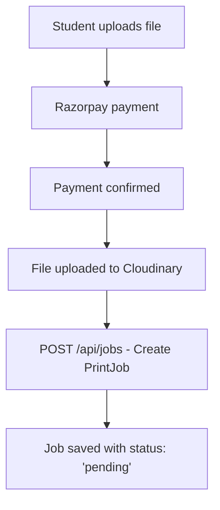
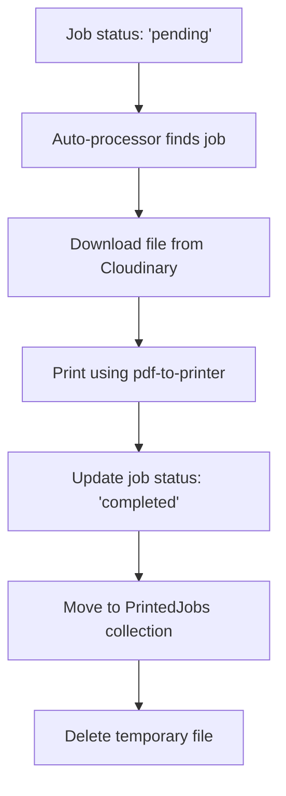

# PrintHub Server-Side Printing Service

A complete Express.js backend service for server-side printing with pdf-to-printer, replacing QZ Tray functionality.

## 🚀 Features

- **Server-Side Printing**: Direct printing using `pdf-to-printer` Node.js package
- **Payment Integration**: Works with Razorpay payment confirmation
- **Cloudinary Integration**: Downloads files from Cloudinary for printing
- **MongoDB Integration**: Uses existing PrintJob schema + new PrintedJob collection
- **Auto-Processing**: Automatically processes pending print jobs every 30 seconds
- **Print Queue Management**: FIFO queue with position tracking
- **Background Services**: Automated cleanup and job processing
- **Comprehensive API**: RESTful endpoints for all printing operations

## 📋 API Endpoints

### Print Job Management
- `POST /api/jobs` - Create new print job after payment
- `POST /api/jobs/:id/print` - Print specific job by ID
- `GET /api/jobs/pending` - Get all pending print jobs
- `GET /api/jobs/printed` - Get all completed print jobs
- `GET /api/jobs/:id/status` - Get job status by ID

### Printer Management
- `GET /api/printers` - Get available printers
- `POST /api/printers/test` - Test printer functionality

### Utilities
- `POST /api/utils/cleanup` - Manual temp file cleanup
- `GET /api/health` - Service health check

## 🛠️ Installation

1. **Install Dependencies**:
   ```bash
   npm install express mongoose cors dotenv axios pdf-to-printer node-cron uuid
   ```

2. **Install Development Dependencies**:
   ```bash
   npm install --save-dev nodemon
   ```

3. **Configure Environment**:
   ```bash
   cp .env.printing.example .env
   # Edit .env with your configuration
   ```

4. **Start the Service**:
   ```bash
   # Development mode
   npm run dev
   
   # Production mode
   npm start
   ```

## 🔧 Configuration

### Environment Variables

```env
# Server Configuration
PORT=3002
NODE_ENV=development

# MongoDB Configuration
MONGODB_URI=mongodb://localhost:27017/PrintHub

# Cloudinary Configuration
CLOUDINARY_CLOUD_NAME=your_cloud_name
CLOUDINARY_API_KEY=your_api_key
CLOUDINARY_API_SECRET=your_api_secret

# Print Service Configuration
AUTO_PRINT_ENABLED=true
AUTO_PRINT_INTERVAL_SECONDS=30
MAX_CONCURRENT_PRINTS=5
```

## 📁 Project Structure

```
server/
├── printServer.js                 # Main server entry point
├── package-printing.json          # Package dependencies
├── .env.printing.example          # Environment template
├── src/
│   ├── models/
│   │   ├── PrintJob.js            # Existing PrintJob model
│   │   └── PrintedJob.js          # New PrintedJob model for history
│   ├── controllers/
│   │   └── printJobController.js  # Print job business logic
│   ├── routes/
│   │   └── printRoutes.js         # API route definitions
│   ├── utils/
│   │   ├── fileUtils.js           # File download/cleanup utilities
│   │   └── printerUtils.js        # Printer interaction utilities
│   └── services/
│       └── printScheduler.js      # Background job processors
├── temp/                          # Temporary file storage (auto-created)
└── logs/                          # Service logs (optional)
```

## 🔄 Workflow

### 1. Payment + Upload Flow


### 2. Server-Side Printing Flow


## 🖨️ Print Settings Mapping

The service maps PrintJob settings to pdf-to-printer options:

```javascript
// PrintJob.settings -> pdf-to-printer options
{
  copies: 3,           // settings.copies
  paperSize: 'A4',     // settings.paperType
  duplex: 'long',      // settings.duplex
  pages: '1-5',        // settings.pages
  color: true,         // settings.color
  monochrome: false    // !settings.color
}
```

## 🤖 Background Services

### Auto-Print Processor
- Runs every 30 seconds
- Processes up to 5 pending jobs at a time
- FIFO queue order (first submitted, first printed)

### Temp File Cleanup
- Runs every hour
- Removes files older than 1 hour
- Prevents disk space issues

### Queue Position Updater
- Runs every 5 minutes
- Updates job queue positions
- Changes status from 'pending' to 'queued'

## 📊 Database Schema

### PrintJob (Existing)
- Uses your existing schema
- Status: 'pending' → 'in-progress' → 'completed'/'failed'

### PrintedJob (New)
```javascript
{
  originalJobId: ObjectId,    // Reference to original PrintJob
  clerkUserId: String,
  printerName: String,        // Which printer was used
  file: Object,               // File details
  settings: Object,           // Print settings used
  printedAt: Date,            // When job was printed
  processingTimeSeconds: Number,
  // ... other fields
}
```

## 🧪 Testing

Test the print system:
```bash
# Test printer connectivity
npm run print-test

# Health check
curl http://localhost:3002/api/health

# List available printers
curl http://localhost:3002/api/printers
```

## 🔐 Security Features

- CORS configuration for frontend origins
- File type validation
- Temporary file cleanup
- Error handling and logging
- Graceful shutdown handling

## 📈 Monitoring

The service provides comprehensive logging:
- Job processing status
- Print success/failure
- File download/cleanup operations
- Background service activities

## 🚨 Error Handling

- Automatic job status updates on failure
- Temporary file cleanup on errors
- Detailed error messages and logging
- Graceful degradation for printer issues

## 🔄 Migration from QZ Tray

This service completely replaces QZ Tray:
- ✅ Server-side printing (no client browser required)
- ✅ All file format support via pdf-to-printer
- ✅ Print settings mapping
- ✅ Queue management
- ✅ Auto-processing
- ✅ Better reliability and error handling

## 🤝 Integration

### Frontend Integration
```javascript
// Create print job after payment
const response = await fetch('/api/jobs', {
  method: 'POST',
  headers: { 'Content-Type': 'application/json' },
  body: JSON.stringify({
    clerkUserId: 'user_123',
    printerId: 'printer_id',
    file: { cloudinaryUrl, publicId, originalName, format, sizeKB },
    settings: { pages: 'all', copies: 1, color: false },
    payment: { transactionId: 'razorpay_payment_id', method: 'card' }
  })
});
```

### Admin Dashboard Integration
```javascript
// Get pending jobs
const pendingJobs = await fetch('/api/jobs/pending').then(r => r.json());

// Print specific job
await fetch(`/api/jobs/${jobId}/print`, { method: 'POST' });
```

Ready to deploy and start server-side printing! 🖨️✨